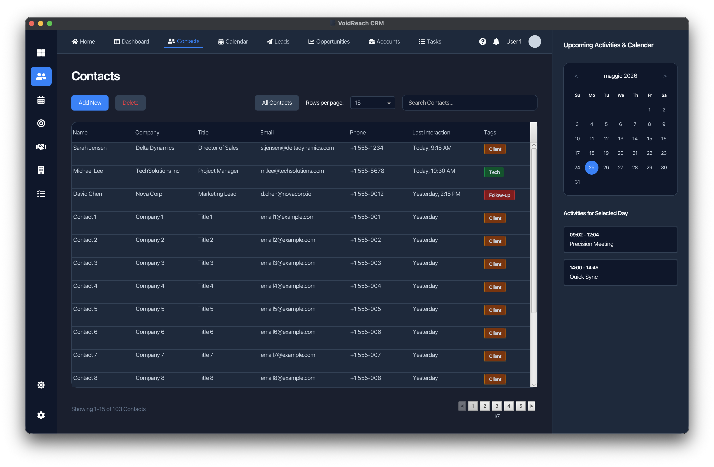
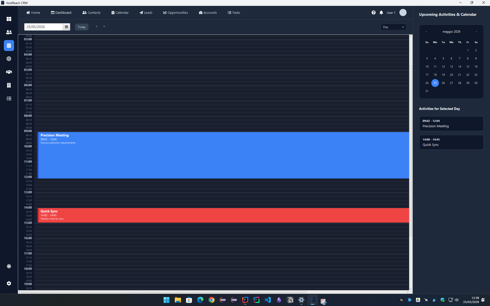

# VoidReach

VoidReach is a desktop CRM, calendar, and task management application built with Java and JavaFX, featuring a modern and clean interface designed for professional use. The project is actively under development and will be expanded with new features and modules over time.

## Local access and persistence

The app includes registration, login, password recovery, password update, and an optional remembered session. Local files are stored under the current user's `.voidreach-crm` directory:

- `users.properties` stores account data;
- `data/<account-id>.properties` stores that account's contacts, tasks, selected calendar date, view mode, and zoom level;
- `avatars/<account-id>-<version>.png` stores the current lossless cropped profile image, when one is set;
- `session.properties` stores only the remembered account email.

Passwords and reset codes are never stored in plain text: they are derived with PBKDF2. In this local demo, the reset code is shown in the application and expires after 15 minutes.

Persistence is separated behind `UserRepository` and `CrmDataRepository`; future JDBC implementations can replace the local repositories while preserving account-scoped data.

---

## Screenshots

| macOS | Windows |
|-------|---------|
|  |  |

---

## Features

### Contact Management
- **Contact Table** — displays Name, Company, Job Title, Email, Phone, Last Interaction, and Tags.
- **Add Contact** — create contacts through a dedicated dialog with name, company, job title, email, phone, tags, and description. Last Interaction is set automatically for new contacts.
- **Edit Contact** — double-click a row to change its editable details.
- **Select and delete contacts** — select one or more contacts, then press `Delete` or `Backspace`; a confirmation dialog prevents accidental deletions.
- **Color-coded Tags** — contacts can be labeled as **Client**, **Tech**, or **Follow-up**, each rendered with a distinct color badge.

### Search & Filtering
- **Real-time search** across Name, Company, and Email fields — results update instantly as you type.

### Pagination
- Configurable rows per page: **15**, **25**, **50**, **100**, or **All**.
- Live pagination info label showing the current range and total contacts (e.g. *Showing 1–15 of 103 Contacts*).

### Calendar & Task Management
- **Day and Week views** with a full 24-hour grid, divided into hours and 15-minute intervals.
- **Create tasks** by clicking on any time slot on the timeline.
- **Drag & drop tasks** to reschedule them by moving them along the timeline.
- **Resize tasks** by dragging the bottom handle of any task block.
- **Edit tasks** by double-clicking a task or right-clicking it — opens a dialog to modify title, start/end time, color, and description.
- **Delete tasks** by selecting a task and pressing `Delete` or `Backspace`.
- **Task colors** — Blue, Red, Green, Yellow, Orange, Purple.
- **Date navigation** — previous day, next day, and jump-to-today buttons.

### Right Sidebar
- **Mini calendar** — monthly view with navigation arrows for month-by-month browsing; the selected day is highlighted in blue, today is outlined.
- **Upcoming Activities** — list of tasks for the selected day, showing time slot and title. Clicking an activity navigates to the Calendar view.

### Theme
- **Dark / Light mode toggle** — switch between themes at any time; the button icon updates accordingly.

### Account
- **Remember me** — optionally reopen the last authenticated account on the next launch without storing a password.
- **Profile avatar** — choose and crop a PNG/JPG from 300x300 up to 20000x20000 pixels (maximum upload 10 MB); the app creates a memory-bounded, high-quality local rendition for the current display scale.

### Navigation
The left sidebar provides access to all sections:
- **Home** *(coming soon)*
- **Dashboard** *(coming soon)*
- **Contacts** — fully implemented
- **Calendar** — fully implemented
- **Leads** *(coming soon)*
- **Opportunities** *(coming soon)*
- **Accounts** *(coming soon)*
- **Tasks** *(coming soon)*
- **Settings** *(coming soon)*

---

## Requirements

- Java JDK 21 or higher
- Apache Maven

---

## How to Run

Clone the repository and, from the `VoidReach-CRM-Final-No-FatJar` directory, run:

```bash
mvn clean javafx:run
```

Or use the provided script:

```bash
./run.sh
```

The Maven module `VoidReach-CRM-Final-No-FatJar` can also be opened and run directly from IntelliJ IDEA.

---

## Project Structure

```
VoidReach-CRM-Final-No-FatJar/
├── pom.xml
├── run.sh
└── src/
    └── main/
        ├── java/
        │   └── com/crm/
        │       ├── app/
        │       │   ├── AppLauncher.java             # Launcher wrapper
        │       │   └── Main.java                    # JavaFX entry point and navigation
        │       ├── controller/
        │       │   ├── LoginController.java         # Authentication views
        │       │   ├── MainController.java          # CRM, calendar, and UI logic
        │       │   └── SplashScreenController.java  # Splash screen controller
        │       ├── model/
        │       │   ├── Contact.java
        │       │   ├── CrmDataSnapshot.java
        │       │   ├── Task.java
        │       │   └── UserAccount.java
        │       ├── repository/
        │       │   ├── CrmDataRepository.java
        │       │   ├── LocalCrmDataRepository.java
        │       │   ├── LocalUserRepository.java
        │       │   └── UserRepository.java
        │       └── service/
        │           ├── AuthService.java
        │           ├── AvatarService.java
        │           └── SessionService.java
        └── resources/
            ├── com/crm/view/
            │   ├── LoginView.fxml          # Login, registration, and recovery
            │   ├── MainView.fxml           # Main UI layout
            │   └── SplashScreen.fxml       # Splash screen layout
            ├── css/
            │   ├── style-dark.css          # Dark theme
            │   └── style.css               # Light theme
            └── images/
                └── app-icon.png            # Application icon
```

---

## License

See [LICENSE](LICENSE) for terms of use.
